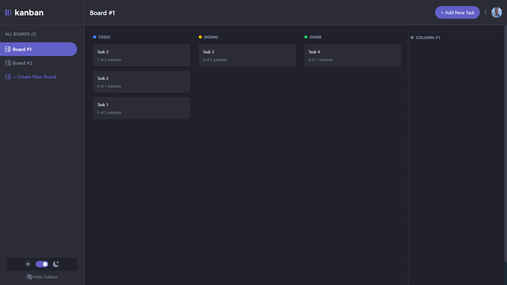

# Kanban – Project Management System

## Overview

The Kanban Project Management System is a full-stack application designed to help teams organize tasks efficiently using the Kanban methodology. The application offers features such as task organization, drag-and-drop functionality for seamless workflow management, and secure authentication using JWT tokens.

This project is built with **Next.js** on the frontend for server-side rendering (SSR) and **Node.js/Express** on the backend for API and business logic. **PostgreSQL** is used for the database, and **TypeORM** is leveraged for ORM-based database management.

## Features

- **Task Organization**: Easily organize tasks into columns like *To-Do*, *In Progress*, and *Completed*.
- **Drag-and-Drop Functionality**: Move tasks between columns smoothly to reflect changes in status.
- **JWT Authentication**: Secure user authentication system with access and refresh tokens for authorization.
- **Real-Time Collaboration**: Share the Kanban board with teammates and stay in sync with live updates.

## Technologies Used

### Frontend

- **Next.js**: React framework with server-side rendering for fast performance and SEO.
- **React**: JavaScript library for building user interfaces.
- **Tailwind CSS**: Utility-first CSS framework for fast styling.
- **TypeScript**: Superset of JavaScript that provides optional static typing.

### Backend

- **Node.js**: JavaScript runtime environment for the backend.
- **Express**: Minimal and flexible Node.js web application framework.
- **PostgreSQL**: Relational database management system.
- **TypeORM**: ORM for managing PostgreSQL database with TypeScript support.
- **JWT (JSON Web Tokens)**: Used for user authentication and authorization.

### Other Tools

- **Passport.js**: Authentication middleware for handling OAuth with Google.
- **Nodemon**: Tool that automatically restarts the backend server during development.

## Installation & Setup

### Backend
## Backend Setup

1. **Install dependencies:**
   ```bash
   npm install
   ```

2. **Set up environment variables:**

   Create a `.env` file in the backend directory and add the following variables:

   ```ini
   CLIENT_ID=<YOUR_GOOGLE_CLIENT_ID>
   CLIENT_SECRET=<YOUR_GOOGLE_CLIENT_SECRET>
   DB_HOST=localhost
   DB_PORT=5432
   DB_USER=<YOUR_USERNAME>
   DB_PASSWORD=<YOUR_PASSWORD>
   DB_NAME=<YOUR_DATABASE_NAME>
   JWT_ACCESS_SECRET=<YOUR_ACCEES_JWT_SECRET>
   JWT_REFRESH_SECRET=<YOUR_REFRESH_JWT_SECRET>
   CLIENT_URL=<YOUR_CLIENT_URL>
   GOOGLE_CALLBACK_URL=<YOUR_GOOGLE_CALLBACK_URL>
   ```

3. **Run the backend server:**
   ```bash
   npm run dev
   ```

---

## Frontend Setup

1. **Change to the frontend directory:**
   ```bash
   cd ../frontend
   ```
2. **Set up environment variables:**

   Create a `.env` file in the backend directory and add the following variables:

   ```ini
   NEXT_PUBLIC_API_URL=<YOUR_API_URL>
   ```
3. **Install dependencies:**
   ```bash
   npm install
   ```

4. **Run the frontend server:**
   ```bash
   npm run dev
   ```

5. **Open the app in your browser:**
   Navigate to [http://localhost:3000](http://localhost:3000).

---

## Usage

- **Sign up and log in:** Users can sign up and log in using their Google account for authentication.
- **Create, update, and delete tasks:** Organize tasks into different columns, update their details, or delete tasks that are no longer needed.
- **Drag and drop tasks:** Move tasks between columns to reflect their current status.
- **Authentication:** Use JWT for secure user authentication.
